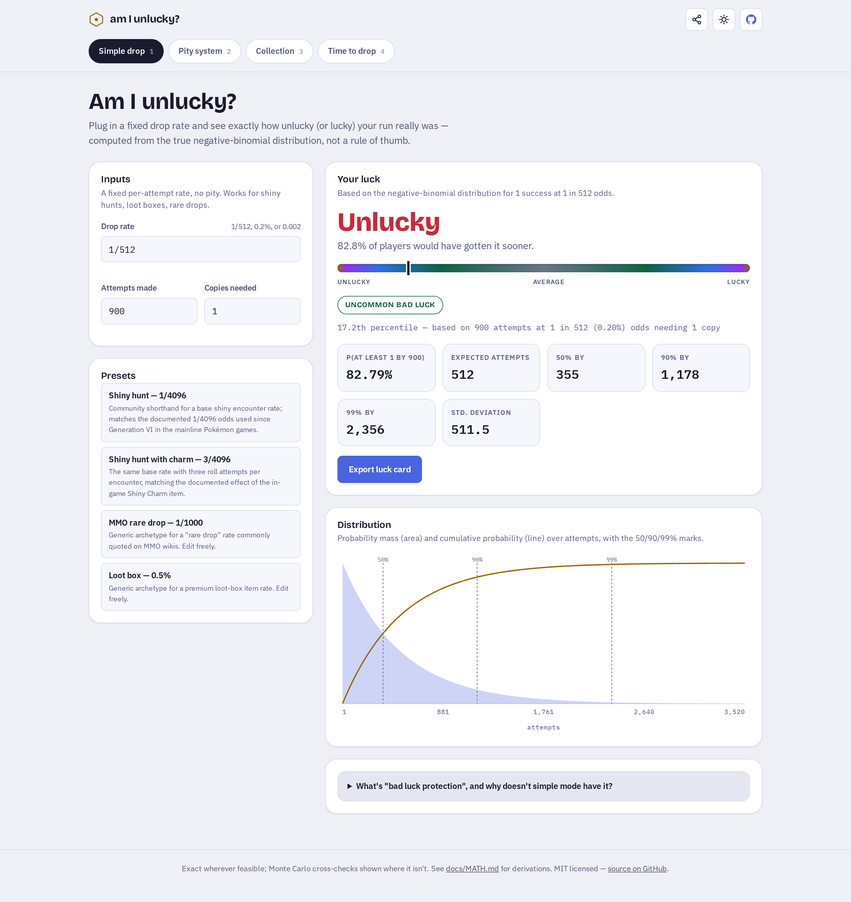
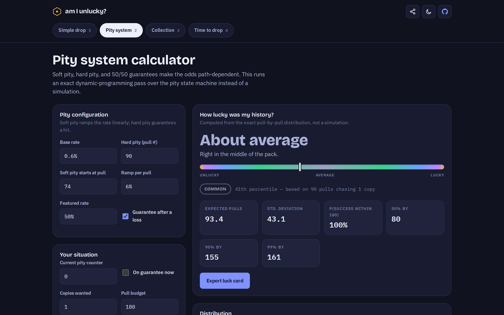
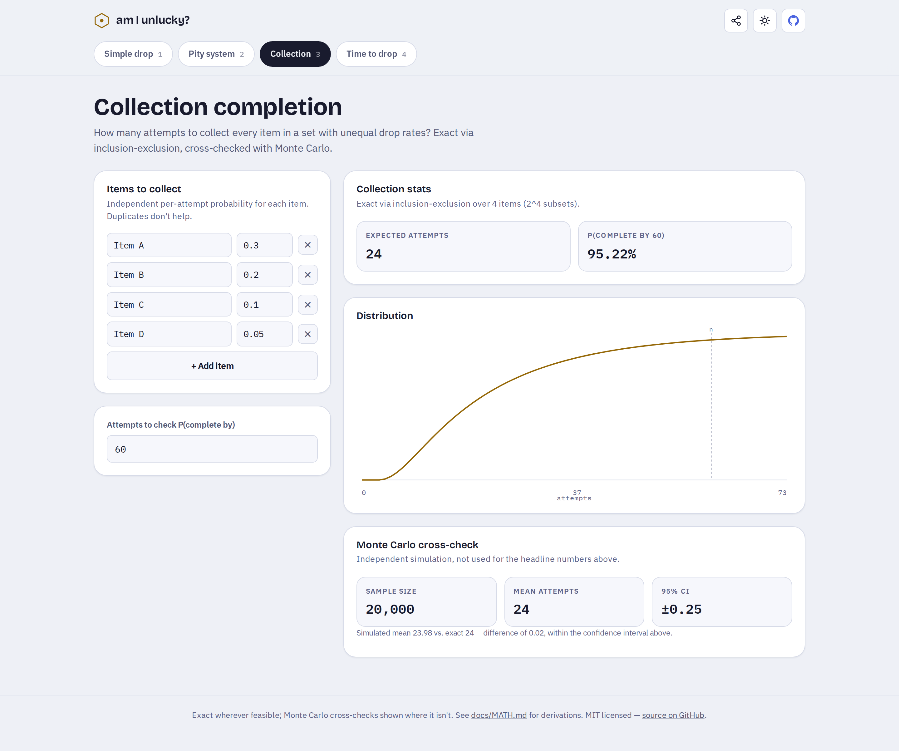
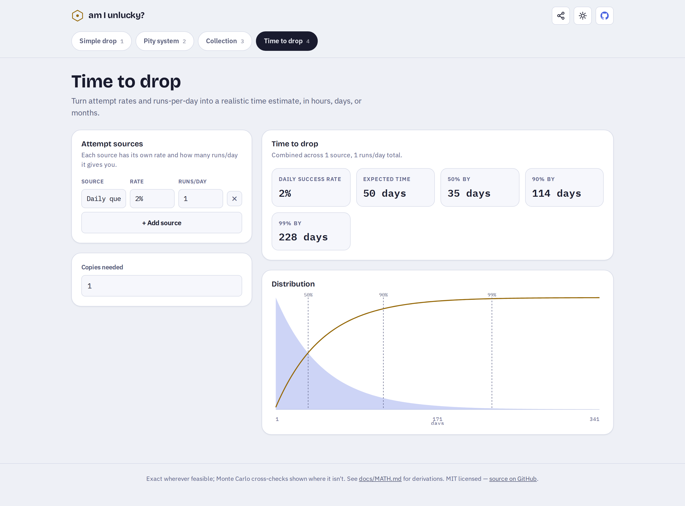
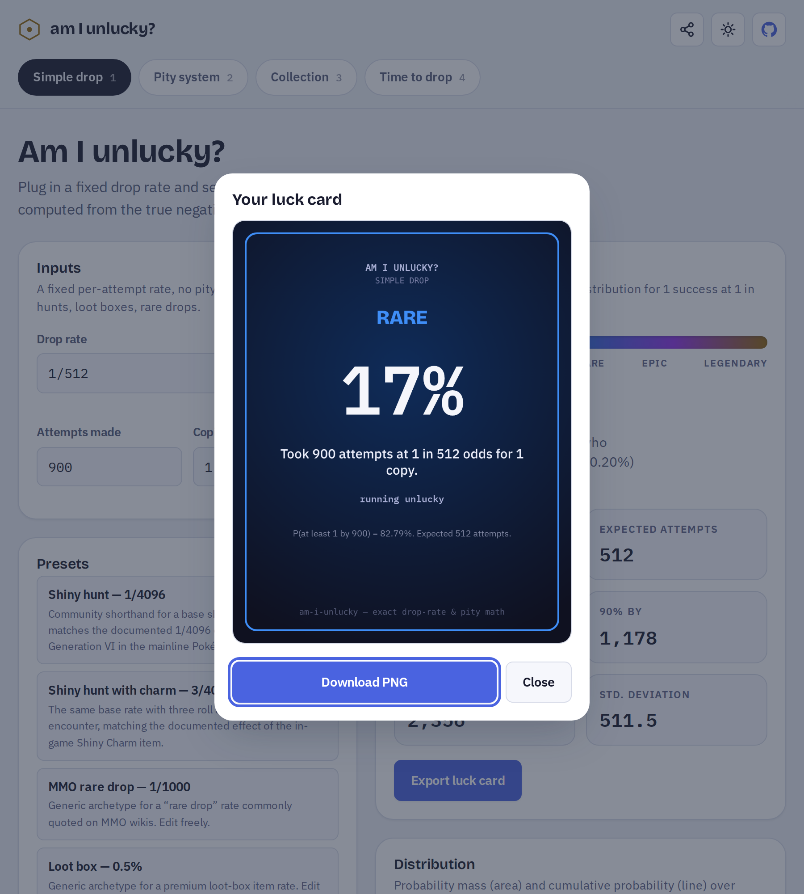
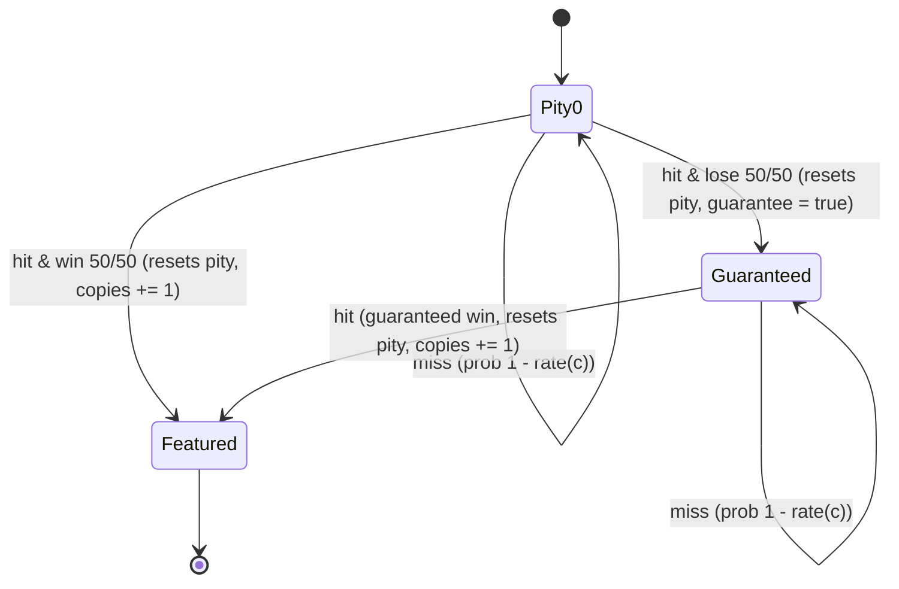

# am I unlucky?

**Exact drop-rate and pity math for gamers. Find out whether you're unlucky, or the system is.**

[](https://github.com/antonsoo/am-i-unlucky/actions/workflows/ci.yml)
[](./LICENSE)
[](https://antonsoo.github.io/am-i-unlucky/)

Players constantly ask "is 900 runs for a 1/512 drop unlucky?" or "how many pulls do I need to be 90% sure?" Answering that correctly needs real probability, and it gets genuinely hard once a pity system is involved — soft pity, hard pity, and 50/50 guarantees make the odds change every pull, so the "expected attempts = 1 / rate" formula everyone reaches for is simply wrong. Most calculators floating around either hard-code one specific game or fall back to Monte Carlo simulation with no stated error bar. This one computes exact probabilities wherever that's mathematically feasible, and says so — with sample sizes and confidence intervals — everywhere it has to fall back to simulation instead.



## Quickstart

```bash
git clone https://github.com/antonsoo/am-i-unlucky.git
cd am-i-unlucky && npm install
npm run dev
```

Open the printed `localhost` URL. That's the whole setup — no build step, no account, no server.

## Features

- **Simple drop** — a fixed rate `p`, attempts `n`, copies needed `k`. Get your luck percentile, `P(at least k by n)`, expected attempts, and the attempts needed for 50/90/99% confidence, from the exact negative-binomial distribution.
- **Pity system** — base rate, soft-pity ramp, hard pity, and an optional 50/50-with-guarantee mechanic. Computed via an exact dynamic-programming pass over the pity Markov chain (not a simulation): expected pulls, percentiles, `P(success within budget)`, and "how lucky was my history" for a pull count you actually used.
- **Collection** — complete a set of items with unequal, independent drop rates. Exact expected attempts and completion probability via inclusion-exclusion, cross-checked against an independent Monte Carlo simulation shown side by side.
- **Time to drop** — combine multiple attempt sources (each with its own rate and runs/day) into a realistic time-to-drop estimate in hours, days, or months.
- **Presets with honest labels** — a generic soft-pity gacha archetype, two shiny-hunt presets that cite Pokémon's actual documented encounter rates (1/4096, and 3/4096 with the Shiny Charm), and generic "MMO rare drop" / "loot box" archetypes. Every preset is fully editable; the UI says where each number comes from.
- **Shareable URLs** — the full input state lives in the query string, so a link reproduces exactly what you saw.
- **Luck card export** — a rarity-colored PNG ("common" through "legendary", by how far your percentile sits from the median in either direction) you can save and share.
- **Light + dark**, keyboard accessible, responsive to 375px, respects `prefers-reduced-motion`, works offline once loaded, zero tracking.



## Usage examples

**Simple drop** — 900 attempts at a 1/512 rate, needing 1 copy:

| Metric               | Value                                   |
| -------------------- | --------------------------------------- |
| P(at least 1 by 900) | 82.79%                                  |
| Luck percentile      | 17.2% ("luckier than 17.2% of players") |
| Expected attempts    | 512                                     |
| 50% / 90% / 99% by   | 355 / 1,178 / 2,356 attempts            |

**Pity system** — the bundled soft-pity gacha preset (0.6% base, soft pity from pull 74, hard pity 90, 50/50 with guarantee), asking for 1 copy from a fresh pity counter:

| Metric             | Value                |
| ------------------ | -------------------- |
| Expected pulls     | 93.4                 |
| Std. deviation     | 43.1                 |
| 50% / 90% / 99% by | 80 / 155 / 161 pulls |


**Collection** — 4 items at rates 0.3 / 0.2 / 0.1 / 0.05, exact via inclusion-exclusion over `2^4` subsets, cross-checked against a 20,000-run Monte Carlo simulation:

| Metric            | Exact | Monte Carlo (n=20,000) |
| ----------------- | ----- | ---------------------- |
| Expected attempts | 24.00 | 23.98 ± 0.25 (95% CI)  |

The two methods agree to within the simulation's own confidence interval — see [docs/MATH.md](./docs/MATH.md) for the derivation.



**Time to drop** — a 2%-per-run source at 1 run/day, needing 1 copy:

| Metric             | Value               |
| ------------------ | ------------------- |
| Expected time      | 50 days             |
| 50% / 90% / 99% by | 35 / 114 / 228 days |





## How it works

The full derivations live in [`docs/MATH.md`](./docs/MATH.md). Summary:

- **Binomial / negative-binomial tails** are computed via the regularized incomplete beta function, $P(X \geq k) = I_p(k, n-k+1)$ for $X \sim \text{Binomial}(n,p)$, evaluated with a continued-fraction algorithm (Lentz's method) rather than by summing individual binomial terms. That keeps it exact and fast even at $n$ in the millions or $p$ as small as $1/1{,}000{,}000$ — see `src/math/numeric.ts`.
- **Pity systems** are modeled as a Markov chain with state `(pity counter, guarantee flag, copies obtained)` and solved by forward dynamic programming over pulls (`src/math/pity.ts`), which is exact — not simulated — whenever the guarantee mechanic bounds the DP horizon. Naive formulas fail here because the per-pull probability isn't constant (soft pity ramps it) and a lost 50/50 deterministically changes the next roll.
- **Collections** with unequal per-item rates use inclusion-exclusion over subsets of items (`src/math/collection.ts`): $E[T] = \sum_{\emptyset \neq S} (-1)^{|S|+1} / P(S)$. That's exact but $O(2^m)$, so it's capped at 24 items for the expectation and 18 for the full CDF curve, with a Monte Carlo cross-check always shown alongside.
- **Time to drop** reduces to the same negative-binomial machinery once multiple sources are collapsed into one exact per-day success probability, $q = 1 - \prod_i (1-p_i)^{\text{runs}_i}$.



## Accuracy and limitations

- All closed-form results are cross-checked in `tests/oracle.test.ts` against fixtures generated by SciPy (`scripts/oracle.py`, `scipy.stats.binom`/`nbinom`/`geom`), typically agreeing to 6-9 decimal digits.
- The pity DP is exact (zero truncated probability mass, verified by `pmf` summing to 1 to within `1e-9`) **only when the guarantee mechanic is enabled** — that's what gives the DP a true, finite horizon (`target × 2 × hardPity` pulls). With the guarantee disabled, the distribution has unbounded support in principle; the app truncates at a generous horizon and honestly reports the un-covered tail probability instead of hiding it.
- Collection mode's exact math is capped at 24 items (expectation) / 18 items (full CDF curve) because inclusion-exclusion is `O(2^m)`. Above that, only the Monte Carlo estimate is available.
- The "luck percentile" is defined as $100 \times (1 - P(T_k \le n))$ — the share of players who'd need at least as many attempts as you did. At `n = 0` this is trivially 100%; the UI hides it until at least one attempt is entered.
- Presets are archetypes, not official data mining. Only the two shiny-hunt presets cite a specific published rate (Pokémon's documented 1/4096 base and 3/4096-with-Shiny-Charm encounter odds, in place since Generation VI); the pity preset and the MMO/loot-box presets are generic and explicitly labeled as such. Every number is editable.
- This is a client-side static site: no accounts, no analytics, nothing phones home. Shared links embed your inputs in the URL query string in plain text.

## Development

```bash
npm test          # vitest — 123 tests across 9 files
npm run lint       # eslint, strict + type-checked
npm run typecheck  # tsc --noEmit, strict mode
npm run build      # tsc --noEmit && vite build
```

Regenerating the SciPy oracle fixtures requires [`uv`](https://docs.astral.sh/uv/):

```bash
uv run --with scipy python3 scripts/oracle.py
```

See [`CONTRIBUTING.md`](./CONTRIBUTING.md) for more.

## Contributing

Issues and PRs are welcome. Please keep `npm run lint`, `npm run typecheck`, and `npm test` green, and add oracle or property-based coverage for any new closed-form math.

## License

[MIT](./LICENSE) © 2026 Anton Soloviev
