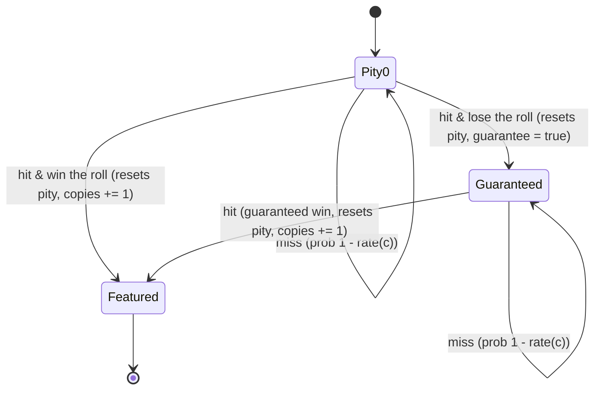

# The math behind am-i-unlucky

This document derives every formula the app uses, and explains why the obvious
shortcuts (`E[attempts] = 1 / rate`, chief among them) are wrong once a pity
system is involved. Code references point at `src/math/`; the claims here are
checked in `tests/oracle.test.ts` against fixtures generated by SciPy
(`scripts/oracle.py`) and, for the pity Markov chain, against a large seeded
simulation (`tests/pity.test.ts`).

## Contents

1. [Simple drop mode](#1-simple-drop-mode)
2. [Why naive formulas fail under pity](#2-why-naive-formulas-fail-under-pity)
3. [The pity Markov chain](#3-the-pity-markov-chain)
4. [Collection mode](#4-collection-mode)
5. [Time to drop](#5-time-to-drop)
6. [Numerical stability](#6-numerical-stability)

## 1. Simple drop mode

A simple drop has a fixed per-attempt success probability $p$. Two classical
distributions describe it:

- **Geometric distribution.** The number of attempts $T$ until the *first*
  success: $P(T = n) = (1-p)^{n-1} p$, $P(T \le n) = 1 - (1-p)^n$.
- **Negative binomial distribution.** The number of attempts $T_k$ until the
  $k$-th success: $P(T_k = n) = \binom{n-1}{k-1} p^k (1-p)^{n-k}$ for $n \ge k$.
  $k=1$ reduces to the geometric case (`src/math/simple.ts::negativeBinomialPmf`,
  `geometricPmf`).

**The duality that does the heavy lifting.** The $k$-th success has happened
by attempt $n$ if and only if a Binomial$(n, p)$ count of successes is at
least $k$:

$$P(T_k \le n) = P(X \ge k), \quad X \sim \text{Binomial}(n, p).$$

This is useful because $P(X \ge k)$ has a closed form in terms of the
**regularized incomplete beta function**:

$$P(X \ge k) = I_p(k,\, n-k+1).$$

`binomialSurvival(n, p, k)` in `src/math/simple.ts` computes exactly this,
via `regularizedIncompleteBeta` in `src/math/numeric.ts`. That function is
evaluated with a continued-fraction algorithm (a standard numerical recipe,
sometimes called Lentz's method) rather than by summing $n - k + 1$ individual
binomial terms. The difference matters in practice: summing terms is $O(n)$
and can lose precision when $p$ is tiny (many near-zero terms) or $n$ is
huge (millions of terms); the continued fraction converges in a bounded
number of iterations regardless of $n$, so `binomialSurvival(10_000_000,
1e-6, 1)` is as fast and as accurate as `binomialSurvival(10, 0.5, 5)`. The
regularized incomplete beta function itself needs $\log \Gamma$ (log-gamma)
for its normalizing constant $B(a,b) = \Gamma(a)\Gamma(b)/\Gamma(a+b)$, computed
via a Lanczos approximation (`logGamma`).

**Luck percentile.** Given that you made $n$ attempts and needed $k$
successes, define

$$\text{luckPercentile}(n, p, k) = 100 \times \bigl(1 - P(T_k \le n)\bigr) = 100 \times P(T_k > n).$$

This is the share of players who would need *more* attempts than you did —
equivalently, the share of players who are less lucky. If you got the $k$-th
success quickly, $n$ is small, $P(T_k \le n)$ is small, and the percentile is
close to 100 (you're luckier than almost everyone). If you needed far more
attempts than expected, $P(T_k \le n)$ is close to 1 and the percentile is
close to 0. Because $P(T_k \le n) = P(X \ge k)$, this is literally
`100 * (1 - binomialSurvival(n, p, k))` — the same function that answers
"P(at least k by n)", just complemented.

Two edge cases are called out explicitly rather than silently producing a
number that *looks* fine but isn't:

- **$n = 0$.** $P(T_k \le 0) = 0$ for any $k \ge 1$ (you can't succeed in zero
  attempts), so the percentile is trivially 100 — not because you're lucky,
  but because *nobody* could have succeeded in fewer attempts either. The UI
  hides the luck meter until at least one attempt is entered.
- **$p = 0$ or $p = 1$.** These are degenerate: at $p=0$ nobody ever
  succeeds, so ranking "how lucky" you are against other players is
  meaningless; at $p=1$ everybody succeeds identically on the $k$-th attempt,
  so there's no variance to be lucky or unlucky about. `simpleDrop` still
  returns honest numbers ($P(\text{at least } k) = 0$ or $1$, expected
  attempts $= \infty$ or $k$), but the UI shows a plain-language note instead
  of a luck-meter verdict, because "luckier than 100% of players" at $p=0$
  would otherwise read as a (false) compliment.

**Attempts for 50/90/99% confidence.** `attemptsForConfidence(k, p, target)`
finds the smallest $n$ with $P(T_k \le n) \ge \text{target}$. For $k = 1$ this
has a closed form via inverting the geometric CDF,
$n = \lceil \ln(1-\text{target}) / \ln(1-p) \rceil$ (checked directly against
this formula in `tests/simple.test.ts`); for general $k$ there's no simple
inversion, so the function grows an upper bound geometrically from the mean
$k/p$ and then binary-searches it using the same exact `binomialSurvival` —
still exact, just not closed-form in $n$.

## 2. Why naive formulas fail under pity

The formula everyone reaches for — "expected attempts $= 1 / \text{rate}$" —
assumes the per-attempt probability is constant and that attempts are
memoryless (each one is an independent Bernoulli trial with the same $p$).
Pity systems violate both assumptions:

- **Soft pity is not constant.** Once you're past the soft-pity threshold,
  the rate increases every pull. The "rate" isn't one number; it's a
  function of how many pulls you've made since your last success.
- **A 50/50-with-guarantee mechanic is path-dependent.** Losing a 50/50 roll
  *deterministically* changes the outcome of your next win: it's now a
  guaranteed success instead of another coin flip. No memoryless
  distribution captures "the outcome of trial $t$ depends on whether you
  lost trial $t-1$'s sub-roll."

Both effects mean that the number of pulls-to-success is not geometric or
negative binomial at all. The only way to get an *exact* answer is to model
the full state machine and solve it — which is what `src/math/pity.ts` does.

## 3. The pity Markov chain

**State.** $(c, g, j)$ — pulls since the last item-tier hit ($c$, resets to 0
on every hit), whether the next win is guaranteed to be featured ($g$, only
meaningful when the guarantee mechanic is enabled), and copies obtained so
far ($j$).

**Per-pull item-tier hit probability**, `itemTierRate(c, config)`:

$$
\text{rate}(c) = \begin{cases}
1 & \text{if } c + 1 \ge \text{hardPity} \\
\text{base} + (\,c + 1 - \text{softPityStart} + 1\,)\cdot\text{increment} & \text{if } c + 1 \ge \text{softPityStart} \\
\text{base} & \text{otherwise}
\end{cases}
$$

(capped at 1), where $c+1$ is the 1-indexed pull number within the current
streak.

**Transition on a pull from state $(c, g, j)$:**

- **Item-tier hit**, probability $\text{rate}(c)$:
  - **Featured** (probability $g \, ? \, 1 : \text{featuredRate}$): pity
    resets, guarantee clears, $j \to j+1$.
  - **Missed** (probability $1 - $ the above, only possible when the
    guarantee mechanic is on and $g$ was false): pity resets, guarantee
    becomes true, $j$ unchanged.
- **No hit**, probability $1 - \text{rate}(c)$: pity increments to $c+1$,
  everything else unchanged.

**Forward DP over pulls.** `pityDistribution` starts with all probability
mass at the caller's initial $(c_0, g_0, j{=}0)$ state and, for each pull
$t = 1, 2, \dots$, pushes the mass through the transition rule above. Any
mass that would move from $j = \text{target}-1$ to $j = \text{target}$ is
instead **absorbed** into `pmf[t]` — the probability that exactly $t$ pulls
were needed to reach the target. Because the state space (pity counter
$\times$ guarantee flag $\times$ copies-still-needed) is small — at most
`hardPity * 2 * target` — this DP is fast: computing the exact distribution
for 10 copies at `hardPity = 90` takes about 57ms and visits a horizon of
1,801 pulls on this machine (14 vCPU WSL2 Linux, 48GB RAM; measured in
`tests/`, see the README's Development section for how to reproduce).

**Why the DP horizon is exact when the guarantee mechanic is on.** Every
item-tier hit resolves within at most `hardPity` pulls, because hard pity
*forces* $\text{rate} = 1$ by pull `hardPity`. Getting one additional copy
costs at most two such cycles in the worst case: one cycle that ends in a
loss (bounded by `hardPity` pulls), and a second cycle whose win is
guaranteed (also bounded by `hardPity` pulls, and guaranteed to be a win).
So the number of pulls to obtain `target` copies is bounded above by
`target * 2 * hardPity`, with **zero probability mass beyond that horizon**
— this isn't a truncation, it's a proof. `pityDistribution` sets its horizon
to exactly this bound (plus a one-pull margin) when `hasGuarantee` is true,
and the test suite checks that `pmf` sums to 1 to within `1e-9` and that
`tailMass < 1e-9` in that case.

**When the guarantee mechanic is off**, an item-tier hit is only featured
with independent probability `featuredRate` and there is no forced win to
bound the wait — in principle you could miss forever, so the distribution
has genuinely unbounded support. `pityDistribution` then uses a large
heuristic horizon (capped at 200,000 pulls) and honestly reports
`exact: false` along with the `tailMass` left uncovered, rather than
pretending the truncated result is exact.

**Derived quantities** (`summarizePity`, `pityLuckPercentile`,
`pityDistributionPoints` in `src/math/pity.ts`) all fall out of the `pmf`
array: the mean and standard deviation are direct sums, the 50/90/99%
pull counts are the smallest $t$ with cumulative probability past that
threshold, `P(success within budget)` is the CDF at the budget, and "how
lucky was my history" for an actual pull count $m$ is
$100 \times P(T > m-1)$ — the same "share of players who needed at least as
many pulls as you" framing as simple mode's luck percentile, applied to the
DP's distribution instead of a closed form.

## 4. Collection mode

Collection mode asks: given $m$ items with independent per-attempt
probabilities $p_1, \dots, p_m$ (duplicates don't help), how many attempts
until you have at least one of each?

**Expected attempts**, via inclusion-exclusion over subsets of items. For a
nonempty subset $S \subseteq \{1, \dots, m\}$, let $P(S) = \sum_{i \in S} p_i$
be the probability that a single attempt produces *some* item in $S$. Then:

$$E[T] = \sum_{\emptyset \neq S \subseteq \{1,\dots,m\}} (-1)^{|S|+1} \frac{1}{P(S)}.$$

This is the natural generalization of the classic equal-probability coupon
collector formula $E[T] = m \cdot H_m$ (harmonic number), and reduces to it
exactly when all $p_i = 1/m$ — checked directly in `tests/collection.test.ts`.

**Completion CDF**, via inclusion-exclusion again, this time over *all*
subsets including the empty one:

$$P(T \le n) = \sum_{S \subseteq \{1,\dots,m\}} (-1)^{|S|} \bigl(1 - P(S)\bigr)^n.$$

$(1-P(S))^n$ is the probability that *none* of the items in $S$ appeared in
$n$ attempts; the alternating sum over all subsets converts "some item is
still missing" into "every item has appeared" by inclusion-exclusion.

**Cost and caps.** Both formulas are exact but $O(2^m)$: `buildSubsetSums`
precomputes $P(S)$ for every mask in $O(2^m)$ time via a standard
subset-DP (`sums[mask] = sums[mask without lowest bit] + p[lowest bit
index]`), and each formula then does one more $O(2^m)$ pass. That's fast for
realistic set sizes (a 16-item banner is $2^{16} = 65{,}536$ subsets, well
under 10ms — measured in the README's Development section) but genuinely
exponential, so `collectionExpectedAttempts` is capped at
`MAX_EXACT_EXPECTATION_ITEMS = 24` items and `collectionCdf` at
`MAX_EXACT_CDF_ITEMS = 18` (the CDF is evaluated once per chart point, so its
cap is tighter). Beyond the cap, only the Monte Carlo estimate below is
available.

**Numerical stability.** The inclusion-exclusion sums alternate in sign and
can involve many terms of similar magnitude that nearly cancel, which is
exactly the situation where naive left-to-right floating point summation
accumulates error. Both sums are computed with `kahanSum` (Kahan summation)
in `src/math/numeric.ts`.

**Monte Carlo cross-check.** `collectionMonteCarlo` independently simulates
the collection process (using a seeded `mulberry32` PRNG for
reproducibility) and reports the sample mean, standard deviation, and a 95%
confidence interval via the normal approximation
$\bar{x} \pm 1.96 \cdot s/\sqrt{n}$. This is always shown in the UI alongside
the exact result — not as a fallback, but as a visible, independent sanity
check with its sample size and CI stated plainly.

## 5. Time to drop

Given several independent attempt sources, each with its own per-attempt
rate $p_i$ and attempts-per-day $r_i$, the probability that a given day
produces **at least one** success is exact, not approximate:

$$q = 1 - \prod_i (1 - p_i)^{r_i}.$$

$(1-p_i)^{r_i}$ is the probability source $i$ produces zero successes that
day (its $r_i$ attempts are independent), and the product over sources is
the probability that *every* source whiffs that day, because the sources
are independent of each other too. `combinedDailyRate` in `src/math/time.ts`
computes exactly this expression — no simulation, no approximation.

Once $q$ is known, "days to get $k$ copies" is precisely the simple-drop
negative-binomial problem from Section 1 with "day" as the unit of attempt:
`timeToDrop` reuses `attemptsForConfidence` and `binomialSurvival` directly,
just parameterized by $q$ instead of a single source's $p$.

## 6. Numerical stability

A few practices recur throughout `src/math/`:

- **Log-space computation.** Binomial coefficients and probability mass
  functions are computed as sums of logarithms (`logGamma`, `logChoose`,
  `Math.log1p`) and only exponentiated at the end, avoiding overflow for
  large $n$ and underflow for tiny $p$. `negativeBinomialPmf`, for instance,
  computes `logChoose(n-1, k-1) + k*log(p) + (n-k)*log1p(1-p)` before a
  single `Math.exp`.
- **`Math.log1p` / `Math.expm1`** are used instead of `Math.log(1+x)` /
  `Math.exp(x)-1` wherever $x$ can be very small (e.g. `geometricCdf`'s
  $1-(1-p)^n$ becomes `-Math.expm1(n * Math.log1p(-p))`), which preserves
  precision that a naive formulation would lose to catastrophic
  cancellation.
- **Kahan summation** for the collection mode's alternating
  inclusion-exclusion sums (Section 4).
- **What "exact" means here.** Every closed form in this document is
  evaluated to IEEE-754 double precision — not simulated, not truncated
  (except the one disclosed case in Section 3) — and cross-checked in
  `tests/oracle.test.ts` against `scipy.stats.binom` / `nbinom` / `geom`
  fixtures (`scripts/oracle.py`), typically agreeing to 6-9 decimal digits
  depending on magnitude. "Exact" is a claim about the *method*
  (closed-form probability theory, not sampling), not a claim of infinite
  precision arithmetic.
