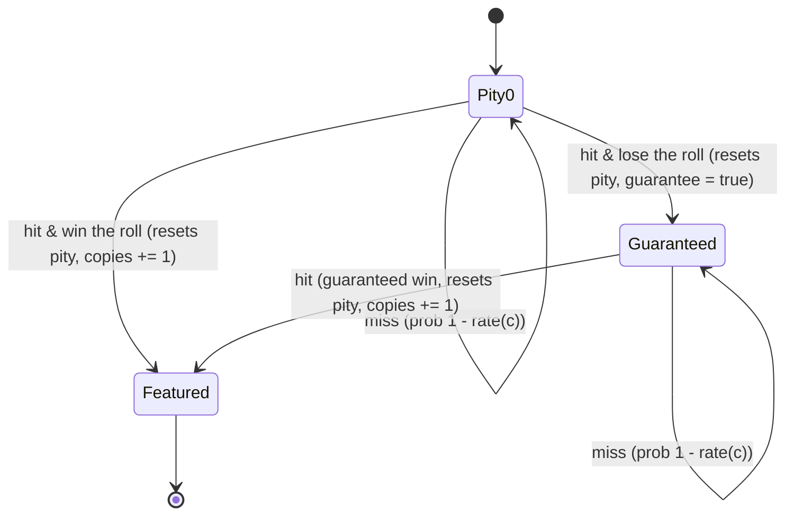

# The math behind am-i-unlucky

This document derives every formula the app uses, and explains why the obvious
shortcuts (`E[attempts] = 1 / rate`, chief among them) are wrong once a pity
system is involved. Code references point at `src/math/`; the claims here are
checked in `tests/oracle.test.ts` against fixtures generated by SciPy
(`scripts/oracle.py`) and, for the pity Markov chain, against a large seeded
simulation (`tests/pity.test.ts`).

## Contents

1. [Simple drop mode](#1-simple-drop-mode)
2. [Why naive formulas fail under pity](#2-why-naive-formulas-fail-under-pity)
3. [The pity Markov chain](#3-the-pity-markov-chain)
4. [Collection mode](#4-collection-mode)
5. [Time to drop](#5-time-to-drop)
6. [Numerical stability](#6-numerical-stability)

## 1. Simple drop mode

A simple drop has a fixed per-attempt success probability $p$. Two classical
distributions describe it:

- **Geometric distribution.** The number of attempts $T$ until the _first_
  success: $P(T = n) = (1-p)^{n-1} p$, $P(T \le n) = 1 - (1-p)^n$.
- **Negative binomial distribution.** The number of attempts $T_k$ until the
  $k$-th success: $P(T_k = n) = \binom{n-1}{k-1} p^k (1-p)^{n-k}$ for $n \ge k$.
  $k=1$ reduces to the geometric case (`src/math/simple.ts::negativeBinomialPmf`,
  `geometricPmf`).

**The duality that does the heavy lifting.** The $k$-th success has happened
by attempt $n$ if and only if a Binomial$(n, p)$ count of successes is at
least $k$:

$$P(T_k \le n) = P(X \ge k), \quad X \sim \text{Binomial}(n, p).$$

`binomialSurvival(n, p, k)` in `src/math/simple.ts` computes $P(X \ge k)$ as a
sum of binomial probabilities, in two steps that keep it exact at any size.

_An accurate single term._ Writing $P(X = k)$ as
$\exp\bigl(\log\binom{n}{k} + k\log p + (n-k)\log(1-p)\bigr)$ subtracts
numbers of size $n$ to get one of size 1, so its error grows with $n$.
`binomialPmf` in `src/math/numeric.ts` uses Catherine Loader's saddle-point
form instead ("Fast and Accurate Computation of Binomial Probabilities", 2000,
the algorithm behind R's `dbinom`):

$$P(X = k) = \sqrt{\frac{n}{2\pi k (n-k)}}\; \exp\Bigl(\delta(n) - \delta(k) - \delta(n-k) - D(k, np) - D(n-k, n(1-p))\Bigr),$$

where $\delta(m) = \log m! - \log\bigl(\sqrt{2\pi m}\,(m/e)^m\bigr)$ is the
error of Stirling's formula (a short series, or exact factorials for
$m \le 15$) and $D(x, \mu) = x\log(x/\mu) + \mu - x$ is a deviance, computed
by its own series when $x$ is close to $\mu$. Every term is small, so nothing
cancels.

_Summing away from the mean._ The tail is then added up term by term from $k$
outward, each term from the last by the ratio
$\frac{P(X=j+1)}{P(X=j)} = \frac{n-j}{j+1}\cdot\frac{p}{1-p}$, always on the
side of $k$ that lies away from the mean $np$ (and subtracted from 1 when that
is the lower side). There the first term is the largest and the rest only
shrink, so the sum stops as soon as a term no longer changes it: a handful of
terms for a rare drop, and at most about nine standard deviations' worth near
the mean. A probability as small as $4 \times 10^{-159}$ comes out as that
number, not as a rounded-off zero.

The work is proportional to the standard deviation $\sqrt{np(1-p)}$, so the
function sets a limit: a variance of $10^{10}$ (ten billion expected successes
at even odds), far beyond any number of attempts a person makes. Past it,
it raises an error rather than taking seconds per call.

An earlier version used the closed form $P(X \ge k) = I_p(k, n-k+1)$ (the
regularized incomplete beta function, by a continued fraction capped at 300
steps, normalized through $\log\Gamma$). That agrees with SciPy up to about a
million attempts and then degrades: off by $10^{-3}$ at $n = 10^7$, and at
$n = 10^9$, $p = 0.5$ it put the chance of reaching the median at 0.
`tests/oracle.test.ts` now checks 647 values from $n = 10$ to $10^{15}$
against `scipy.stats.binom` to nine significant digits.

**Luck percentile.** Given that you made $n$ attempts and needed $k$
successes, define

$$\text{luckPercentile}(n, p, k) = 100 \times \bigl(1 - P(T_k \le n)\bigr) = 100 \times P(T_k > n).$$

This is the share of players who would need _more_ attempts than you did —
equivalently, the share of players who are less lucky. If you got the $k$-th
success quickly, $n$ is small, $P(T_k \le n)$ is small, and the percentile is
close to 100 (you're luckier than almost everyone). If you needed far more
attempts than expected, $P(T_k \le n)$ is close to 1 and the percentile is
close to 0. Because $P(T_k \le n) = P(X \ge k)$, this is literally
`100 * (1 - binomialSurvival(n, p, k))` — the same function that answers
"P(at least k by n)", just complemented.

That reading assumes the $k$-th success came _on_ attempt $n$. A player
**still waiting** after $n$ attempts will need more than $n$, so their best case
is the drop coming on attempt $n + 1$, which scores
$100 \times P(T_k > n + 1)$; every later attempt scores lower. So for a player
still waiting, the app:

- calls it **unlucky** once $P(T_k \le n) > 0.6$ — most players would have
  it by now — and says so in those terms ("82.8% of players would have it by
  now");
- otherwise says **not unlucky yet**, never "lucky": being without the drop
  when most players are too is ordinary;
- shows that best case, labelled "at best", and keeps the meter's needle and
  rarity badge at or below the median.

Shared links from before this distinction existed are read as "got it on
attempt $n$", which is what the number meant then.

Two edge cases are called out explicitly rather than silently producing a
number that _looks_ fine but isn't:

- **$n = 0$.** $P(T_k \le 0) = 0$ for any $k \ge 1$ (you can't succeed in zero
  attempts), so the percentile is trivially 100 — not because you're lucky,
  but because _nobody_ could have succeeded in fewer attempts either. The UI
  hides the luck meter until at least one attempt is entered.
- **$p = 0$ or $p = 1$.** These are degenerate: at $p=0$ nobody ever
  succeeds, so ranking "how lucky" you are against other players is
  meaningless; at $p=1$ everybody succeeds identically on the $k$-th attempt,
  so there's no variance to be lucky or unlucky about. `simpleDrop` still
  returns honest numbers ($P(\text{at least } k) = 0$ or $1$, expected
  attempts $= \infty$ or $k$), but the UI shows a plain-language note instead
  of a luck-meter verdict, because "luckier than 100% of players" at $p=0$
  would otherwise read as a (false) compliment.

**Attempts for 50/90/99% confidence.** `attemptsForConfidence(k, p, target)`
finds the smallest $n$ with $P(T_k \le n) \ge \text{target}$. For $k = 1$ this
has a closed form via inverting the geometric CDF,
$n = \lceil \ln(1-\text{target}) / \ln(1-p) \rceil$ (checked directly against
this formula in `tests/simple.test.ts`); for general $k$ there's no simple
inversion, so the function grows an upper bound geometrically from the mean
$k/p$ and then binary-searches it using the same exact `binomialSurvival` —
still exact, just not closed-form in $n$.

## 2. Why naive formulas fail under pity

The formula everyone reaches for — "expected attempts $= 1 / \text{rate}$" —
assumes the per-attempt probability is constant and that attempts are
memoryless (each one is an independent Bernoulli trial with the same $p$).
Pity systems violate both assumptions:

- **Soft pity is not constant.** Once you're past the soft-pity threshold,
  the rate increases every pull. The "rate" isn't one number; it's a
  function of how many pulls you've made since your last success.
- **A 50/50-with-guarantee mechanic is path-dependent.** Losing a 50/50 roll
  _deterministically_ changes the outcome of your next win: it's now a
  guaranteed success instead of another coin flip. No memoryless
  distribution captures "the outcome of trial $t$ depends on whether you
  lost trial $t-1$'s sub-roll."

Both effects mean that the number of pulls-to-success is not geometric or
negative binomial at all. The only way to get an _exact_ answer is to model
the full state machine and solve it — which is what `src/math/pity.ts` does.

## 3. The pity Markov chain

**State.** $(c, g, j)$ — pulls since the last item-tier hit ($c$, resets to 0
on every hit), whether the next win is guaranteed to be featured ($g$, only
meaningful when the guarantee mechanic is enabled), and copies obtained so
far ($j$).

**Per-pull item-tier hit probability**, `itemTierRate(c, config)`:

$$
\text{rate}(c) = \begin{cases}
1 & \text{if } c + 1 \ge \text{hardPity} \\
\text{base} + (\,c + 1 - \text{softPityStart} + 1\,)\cdot\text{increment} & \text{if } c + 1 \ge \text{softPityStart} \\
\text{base} & \text{otherwise}
\end{cases}
$$

(capped at 1), where $c+1$ is the 1-indexed pull number within the current
streak.

**Transition on a pull from state $(c, g, j)$:**

- **Item-tier hit**, probability $\text{rate}(c)$:
  - **Featured** (probability $g \, ? \, 1 : \text{featuredRate}$): pity
    resets, guarantee clears, $j \to j+1$.
  - **Missed** (probability $1 - $ the above, only possible when the
    guarantee mechanic is on and $g$ was false): pity resets, guarantee
    becomes true, $j$ unchanged.
- **No hit**, probability $1 - \text{rate}(c)$: pity increments to $c+1$,
  everything else unchanged.

**Forward DP over pulls.** `pityDistribution` starts with all probability
mass at the caller's initial $(c_0, g_0, j{=}0)$ state and, for each pull
$t = 1, 2, \dots$, pushes the mass through the transition rule above. Any
mass that would move from $j = \text{target}-1$ to $j = \text{target}$ is
instead **absorbed** into `pmf[t]` — the probability that exactly $t$ pulls
were needed to reach the target. Because the state space (pity counter
$\times$ guarantee flag $\times$ copies-still-needed) is small — at most
`hardPity * 2 * target` — this DP is fast: computing the exact distribution
for 10 copies at `hardPity = 90` visits a horizon of 1,801 pulls and runs
in tens of milliseconds on ordinary hardware, fast enough to recompute on
every keystroke in the UI.

**Why the DP horizon is exact when the guarantee mechanic is on.** Every
item-tier hit resolves within at most `hardPity` pulls, because hard pity
_forces_ $\text{rate} = 1$ by pull `hardPity`. Getting one additional copy
costs at most two such cycles in the worst case: one cycle that ends in a
loss (bounded by `hardPity` pulls), and a second cycle whose win is
guaranteed (also bounded by `hardPity` pulls, and guaranteed to be a win).
So the number of pulls to obtain `target` copies is bounded above by
`target * 2 * hardPity`, with **zero probability mass beyond that horizon**
— this isn't a truncation, it's a proof. `pityDistribution` sets its horizon
to exactly this bound (plus a one-pull margin) when `hasGuarantee` is true,
and the test suite checks that `pmf` sums to 1 to within `1e-9` and that
`tailMass < 1e-9` in that case.

**When the guarantee mechanic is off**, an item-tier hit is only featured
with independent probability `featuredRate` and there is no forced win to
bound the wait — in principle you could miss forever, so the distribution
has genuinely unbounded support. `pityDistribution` then uses a large
heuristic horizon (capped at 200,000 pulls) and honestly reports
`exact: false` along with the `tailMass` left uncovered, rather than
pretending the truncated result is exact.

**Derived quantities** (`summarizePity`, `pityLuckPercentile`,
`pityDistributionPoints` in `src/math/pity.ts`) all fall out of the `pmf`
array: the mean and standard deviation are direct sums, the 50/90/99%
pull counts are the smallest $t$ with cumulative probability past that
threshold, `P(success within budget)` is the CDF at the budget, and "how
lucky was my history" for an actual pull count $m$ is
$100 \times P(T > m-1)$ — the same "share of players who needed at least as
many pulls as you" framing as simple mode's luck percentile, applied to the
DP's distribution instead of a closed form.

```mermaid
stateDiagram-v2
    [*] --> Pity0
    Pity0 --> Pity0: miss (prob 1 - rate(c))
    Pity0 --> Featured: hit & win the roll (resets pity, copies += 1)
    Pity0 --> Guaranteed: hit & lose the roll (resets pity, guarantee = true)
    Guaranteed --> Guaranteed: miss (prob 1 - rate(c))
    Guaranteed --> Featured: hit (guaranteed win, resets pity, copies += 1)
    Featured --> [*]
```

## 4. Collection mode

Each attempt produces **at most one listed item**. Attempts are independent,
with fixed rates $p_1, \dots, p_m$, and $\sum_i p_i \le 1$. Item outcomes
within an attempt are mutually exclusive, not independent rolls. The unused
probability covers no drop and all unlisted items. Collect one of every item;
remove already-owned items from the input without renormalizing the others.
Duplicates and unlisted drops still consume an attempt. Pity, trading and
multiple independent item rolls per attempt are outside this model.

**Expected attempts.** Let $S$ be the set of still-missing items, with
$P(S)=\sum_{i\in S}p_i$. Conditioning on the next attempt gives

$$E(S)=1+(1-P(S))E(S)+\sum_{i\in S}p_i E(S\setminus\{i\}).$$

Rearranging yields a recurrence with nonnegative terms:

$$E(\varnothing)=0,\qquad E(S)=\frac{1}{P(S)}+\sum_{i\in S}\frac{p_i}{P(S)}E(S\setminus\{i\}).$$

The implementation evaluates subsets in order and scales all means by the
smallest positive rate to avoid intermediate overflow. It never subtracts
nearly equal large values. This agrees with the classical $mH_m$ mean when
$p_i=1/m$. A zero-rate item makes completion impossible; a positive rate
whose mean overflows IEEE-754 is instead labeled beyond numeric range.

**Completion CDF.** Inclusion-exclusion gives

$$P(T\le n)=\sum_{S\subseteq\{1,\dots,m\}}(-1)^{|S|}(1-P(S))^n.$$

For small attempt counts a positive state recurrence avoids cancellation.
Its total work per evaluator is limited to about two million state/item
visits, with at most 256 forward steps. Outside that range, pair each subset
of all but the rarest item with the same subset including that item. If its
rate is $r$ and the other subset's total is $s$, its difference is evaluated as

$$\exp(n\log1p(-s))\left[-\operatorname{expm1}\left(n\log1p\left(-\frac{r}{1-s}\right)\right)\right].$$

This preserves contributions even when `1 - r` rounds to 1. A compensated
sum combines the paired terms. The subset tables are built once per plan,
not once per chart point. Structural cases have direct answers: $n<m$ or
any zero-rate item gives zero; at $n=m$ the chance is $m!\prod_i p_i$.

The formulas are exact methods evaluated in double precision. Alternating
sums can still lose relative accuracy in tiny tails. The UI labels positive
but unresolved chances below `1e-9` as below displayed precision, never as an
impossible set. The numerical threshold is a display safeguard, not a
rigorous error certificate. Values below the floating-point range can
underflow, and values close to one can round to one. Forty independent
120-digit Decimal fixtures check means and CDFs, including highly unequal
rates, a `1e-20` rate and the 16-item boundary. Small fixtures additionally
cross-check by enumerating all possible sequences of drop outcomes. The
reference mean uses unpaired inclusion-exclusion instead of production's
positive recurrence (`scripts/collection-oracle.py`).

**Work limits.** Exact means and CDFs support up to 16 items. Mean work is
$O(m2^m)$ and each later CDF evaluation is $O(2^m)$; chart rendering is bounded
to 160 points. Sets of 17 through 32 items use clearly labeled simulation
estimates for the mean, budget probability and chart. Budgets and chart
horizons stop at one billion attempts. Analytical means are not truncated
at that horizon. The library validates finite rates, total probability,
whole attempt budgets, item counts and simulation limits before work starts.
Totals exceeding one by at most four machine epsilons are treated as boundary
rounding and scaled to one; larger excesses are rejected. Workers own their
requests and terminate on edits, navigation or a 15-second timeout.

**Simulation.** Each seeded run jumps directly to its next new item. With
unseen probability $q$, the wait is geometric:

$$W=\left\lfloor\frac{\log(1-U)}{\log(1-q)}\right\rfloor+1.$$

A second uniform draw chooses the item among the unseen rates, conditional
on that event. Recompute $q$ from the remaining items after removing the
new one; this preserves very small rates after common items are collected.
At most $m$ jumps are needed per run, independent of the number of attempts.
A zero-rate set needs no random draws. The UI uses 20,000 runs with a fixed
`mulberry32` seed; the library caps trials at 100,000. This finite PRNG and
normal approximations are practical checks, not formal error guarantees.

A run that has not completed by one billion attempts is **censored**, and
its count stays visible. If any run is censored, the completion mean and
its confidence interval are withheld: averaging only completed runs would
bias the estimate downward. With no censoring and at least two runs, report
$\bar{x}\pm1.96s/\sqrt{N}$, clipped at zero, as an approximate 95% interval
for the **mean**, not for individual completion times. The cross-check says
whether the calculated mean actually lies inside that interval; disagreement
is possible and is shown honestly.

For larger sets, the budget estimate uses the fraction of **all** trials
that completed by the budget, including censored trials in the denominator.
A Wilson 95% interval remains nonzero in width even when no runs succeed.
This is valid only for budgets no larger than the simulation's censoring
horizon. The empirical chart uses the same all-trial denominator. Shading
shows the probability mass of each plotted interval; lines connect the
cumulative probabilities at its endpoints.

## 5. Time to drop

Each source has a fixed per-attempt probability $p_i$, an **integer**
batch size $a_i$, and an interval $s_i$ of 1 or 7 days. The first batch
finishes at the end of day $s_i$, with later batches on its multiples.
After $d$ complete days, that source has made

$$n_i(d) = a_i \lfloor d/s_i \rfloor$$

independent attempts. Its copy count is
$X_i(d) \sim \operatorname{Binomial}(n_i(d),p_i)$. For $k$ required copies,

$$P(D_k \le d) = P\left(\sum_i X_i(d) \ge k\right).$$

The implementation convolves the count distributions below $k$, retaining
an absorbing state for reaching the goal. Upper-tail contributions are
added directly, preserving very small completion probabilities that
$1-P(\text{not finished})$ would round to zero. Equal-rate groups are
combined; guaranteed copies are accounted for before random copies.
Symmetric count distributions retain an exact 50% majority boundary.
Confidence milestones use a monotone search over **whole days**.

For **one copy** with daily batches, the geometric reduction still holds:
$q = 1-\prod_i(1-p_i)^{a_i}$ and $E[D_1]=1/q$. This is evaluated with
`log1p` and `expm1`. It does **not** extend to $k>1$: a batch can give
multiple copies. For example, ten guaranteed daily attempts give five
copies on day 1. Versions before 0.3.0 incorrectly predicted five days.
Fractional daily attempts also lack an exact schedule interpretation;
use one weekly attempt rather than $1/7$ of an attempt per day.

### Exact expected time

The daily/weekly schedule repeats every $L=1$ or $7$ days. Let $Y_d$ be
the copies obtained in the first $d$ days of one cycle, and define
$c_j=P(Y_L=j)$ and
$g_r=\sum_{d=0}^{L-1}P(Y_d<r)=E[\min(D_r,L)]$.

After the first cycle, a run that still needs copies starts the same
schedule again, with fewer copies remaining. Thus, with $E_0=0$,

$$E_r = g_r + \sum_{j=0}^{r-1} c_j E_{r-j},$$

or equivalently,

$$E_r = \frac{g_r+\sum_{j=1}^{r-1}c_jE_{r-j}}{1-c_0}.$$

The denominator is computed directly as the chance of at least one copy
in a cycle, avoiding cancellation for rare drops. This finite recurrence
does not truncate time or use simulation. Two daily attempts at 50%, for
two required copies, give $E_2=20/9$ days; two weekly attempts give
$140/9$ days.

### Bounds and independent checks

- Up to 12 sources, 100 required copies, and 1,000,000 attempts per batch.
- Budget probabilities and confidence searches cover up to 1,000,000,000
  days, keeping each source's attempt count exactly representable.
  A milestone beyond that limit is `null`, displayed as "Over ... days",
  rather than infinity. The mean has no search horizon.
- No productive sources means an impossible goal. An overflowing mean
  is separately reported as beyond numeric range.
- Results use double precision. Very small tails may underflow; inputs
  whose probability is within rounding error of a confidence threshold
  can make the threshold numerically ambiguous. The chart groups all
  finishing days into at most 159 intervals through the 99% milestone
  (or the search limit), states its covered probability, and connects
  interval-end CDF values. It does not sample and discard intervening mass.
- Fixed independent probabilities, no pity, no missed batches, and
  synchronized starts as specified above. Calendar reset offsets and
  within-day timing are not modeled.

`scripts/time-oracle.py` independently advances **individual Bernoulli
attempts**, using 80-digit Python Decimal arithmetic, and sums the survival
probability over successive days. It bounds the unsummed expectation
below $10^{-30}$ rather than assuming a finite cutoff is exact. The 32
committed fixtures check expected times, probabilities, and the earliest
50/90/99% days in `tests/time-oracle.test.ts`. Additional enumerated cases
and deterministic, rare-event, validation, and numeric-limit regressions
live in `tests/time.test.ts`.

## 6. Numerical stability

A few practices recur throughout `src/math/`:

- **Log-space computation.** Binomial coefficients and probability mass
  functions are computed as sums of logarithms (`logGamma`, `logChoose`,
  `Math.log1p`) and only exponentiated at the end, avoiding overflow for
  large $n$ and underflow for tiny $p$. `negativeBinomialPmf`, for instance,
  computes `logChoose(n-1, k-1) + k*log(p) + (n-k)*log1p(-p)` before a
  single `Math.exp`.
- **`Math.log1p` / `Math.expm1`** are used instead of `Math.log(1+x)` /
  `Math.exp(x)-1` wherever $x$ can be very small (e.g. `geometricCdf`'s
  $1-(1-p)^n$ becomes `-Math.expm1(n * Math.log1p(-p))`), which preserves
  precision that a naive formulation would lose to catastrophic
  cancellation.
- **Kahan summation** for the collection mode's alternating
  inclusion-exclusion sums (Section 4).
- **What "exact" means here.** An analytical result comes from probability
  formulas or a finite state recurrence, evaluated in IEEE-754 double
  precision. It does not claim infinite precision. Simulation estimates,
  numerical limits and any truncated horizons are disclosed in Sections
  3-5. Simple-drop results are checked against SciPy fixtures in
  `tests/oracle.test.ts`; schedules and collections have independent Decimal
  fixtures in `tests/time-oracle.test.ts` and `tests/collection-oracle.test.ts`.
